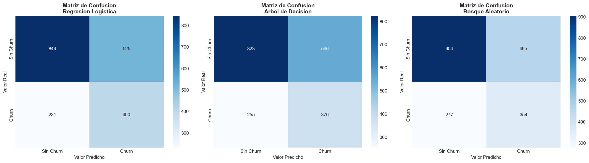
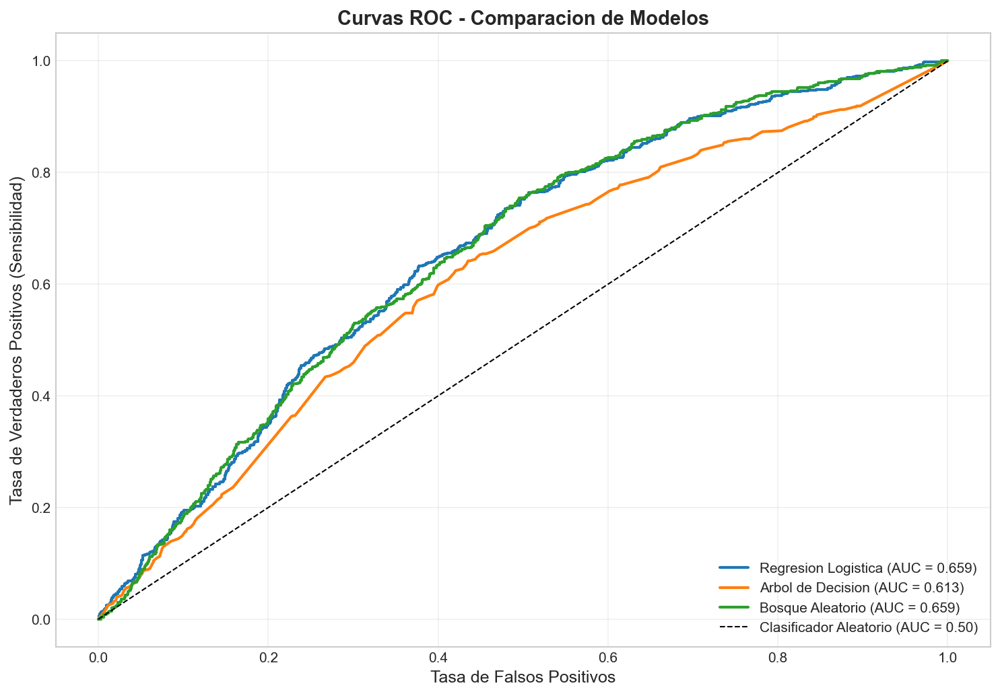
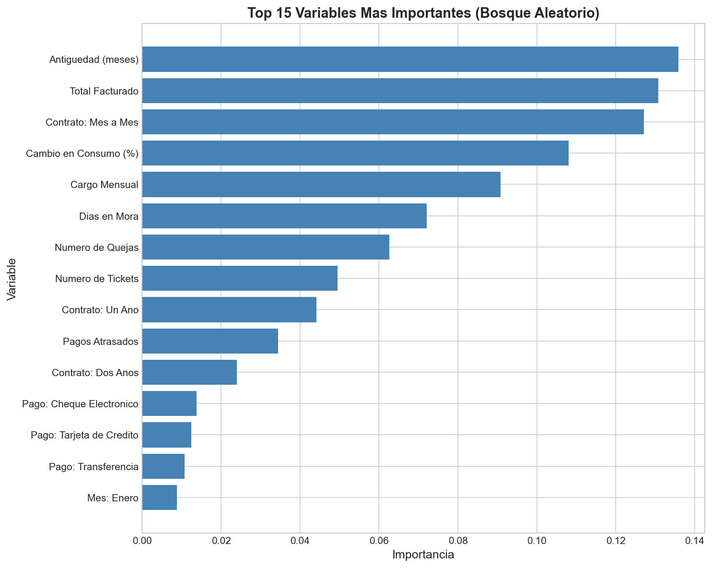
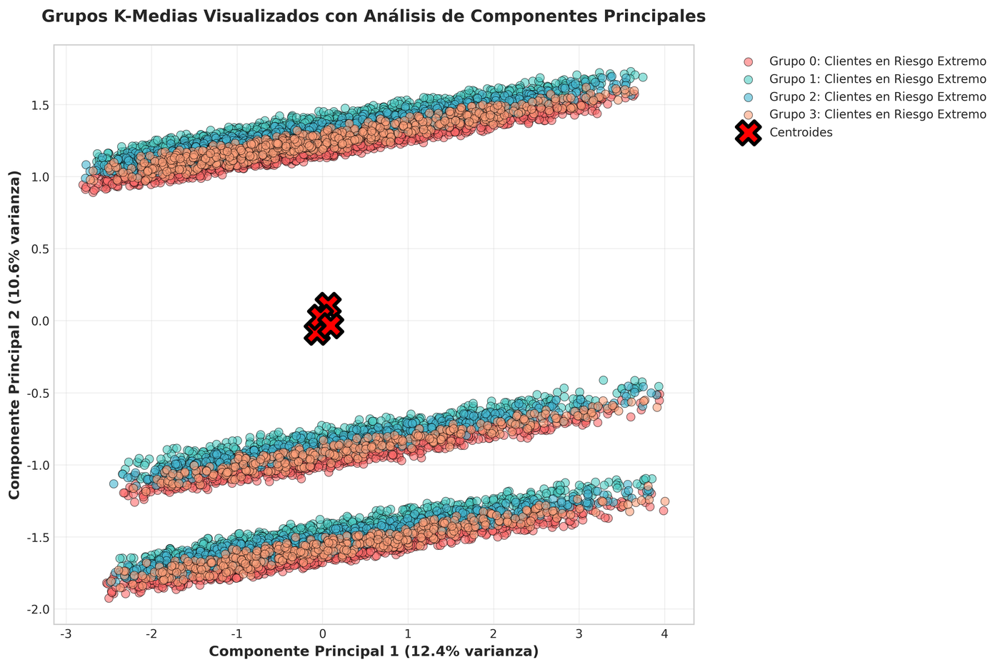
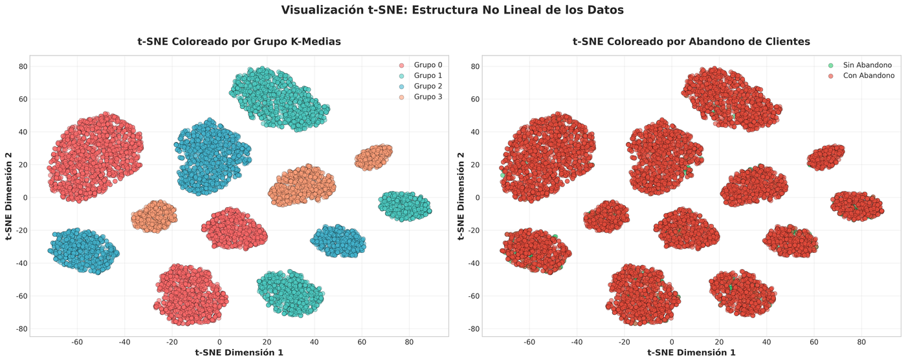
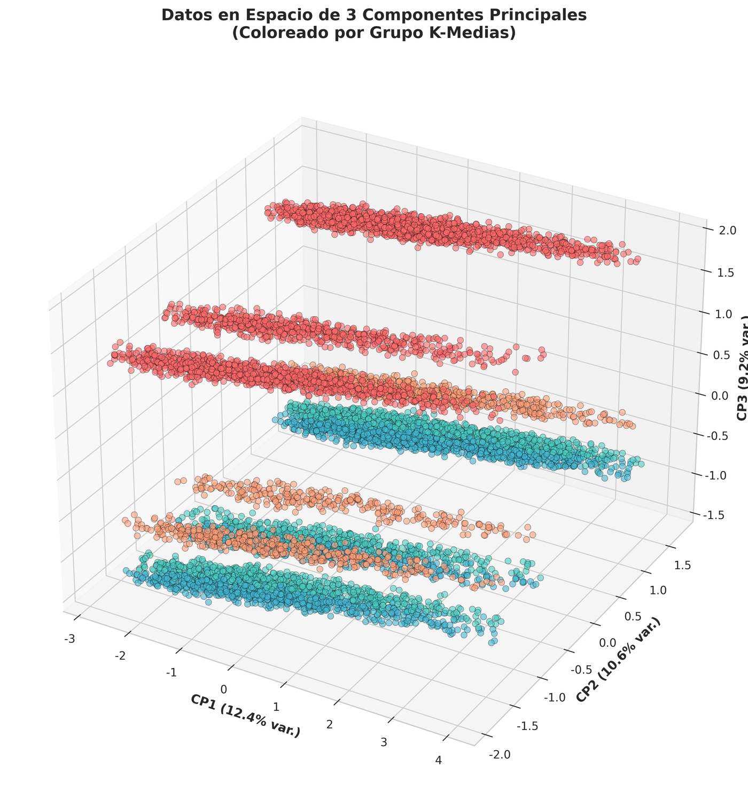
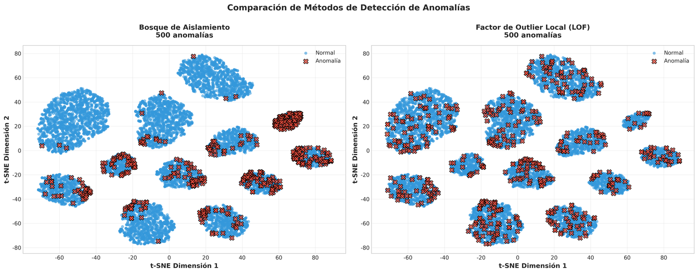
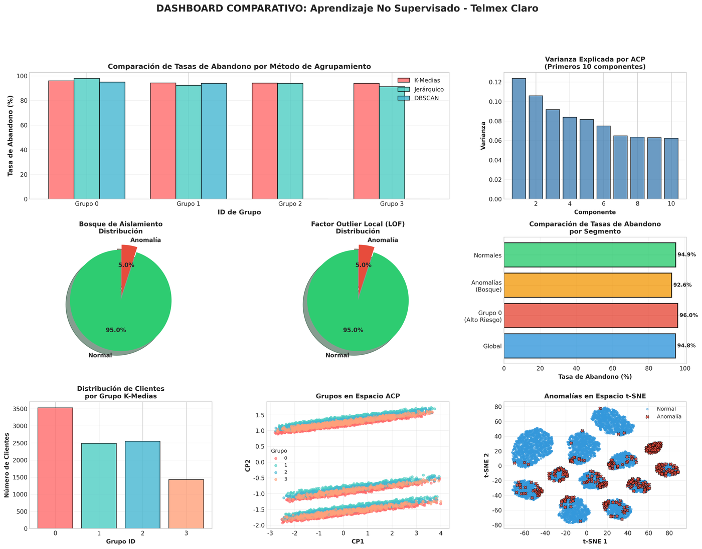

# Customer Churn Prediction — Telmex Claro (Tabular Classification)

[](https://www.python.org/)
[](https://numpy.org/)
[](https://pandas.pydata.org/)
[](https://scikit-learn.org/)
[](https://scipy.org/)
[](https://matplotlib.org/)
[](https://seaborn.pydata.org/)
[](http://rasbt.github.io/mlxtend/)
[](https://jupyter.org/)

## Overview

A machine learning coursework project that predicts churn for a simulated
telecom operator, **"Telmex Claro."** Since real customer data wasn't
available, each script generates its own synthetic-but-realistic dataset
(10,000 customers) with a churn label driven by an interpretable business
risk score — not random noise — so the models have real signal to learn from.

The project was built as a three-part deliverable for **Aprendizaje de
Máquina**, part of the **Especialización en Analítica de Datos** at
**Universidad Piloto de Colombia**, with two classmates. Each part is a
"profundización" (deep dive) on top of the previous one, using the same
business case throughout:

| Unit | Focus | Entry point |
|---|---|---|
| **Unidad 1** | End-to-end baseline: Logistic Regression + Random Forest (30/60-day churn), K-Means segmentation, and a combined "who + what type" action plan | `scripts/run_unit1_baseline.py` |
| **Unidad 2** | Supervised deep dive: adds a Decision Tree, `GridSearchCV` hyperparameter search, and over/underfitting (generalization) analysis | `scripts/run_unit2_supervised.py` |
| **Unidad 3** | Unsupervised deep dive: DBSCAN & hierarchical clustering, PCA/t-SNE, anomaly detection (Isolation Forest, LOF, Elliptic Envelope), association rules, and missing-data imputation (KNN/Simple) | `scripts/run_unit3_unsupervised.py` |

The course wrapped up on **February 18, 2026**. This repo has since been
restructured from three long, standalone scripts into a shared package so
the code is easier to read and reuse — see [Restructuring notes](#restructuring-notes).

## Results

Numbers below are from an actual run of each script (seeded, so you'll get
the same ones). Full write-ups — methodology, more charts, business
recommendations — are in `reports/`; this is the highlight reel.

### Unidad 1 — Baseline

Logistic Regression vs. Random Forest, on both churn horizons:

| Model | Accuracy | Precision | Recall | F1 | ROC-AUC | PR-AUC |
|---|---|---|---|---|---|---|
| Log. Regression (30d) | 0.622 | 0.432 | 0.634 | 0.514 | 0.659 | 0.433 |
| Random Forest (30d) | 0.629 | 0.432 | 0.561 | 0.488 | 0.659 | 0.420 |
| Log. Regression (60d) | 0.686 | 0.717 | 0.665 | 0.690 | 0.747 | 0.762 |
| Random Forest (60d) | 0.692 | 0.727 | 0.661 | 0.693 | 0.749 | 0.754 |

The 60-day target is meaningfully easier to predict than the 30-day one —
more time for risk signals (complaints, late payments) to accumulate before
the label is set.

K-Means (k=4) then segments the same customers by behavior, independent of
those churn labels:

| Cluster | Customers | Avg. tenure | Avg. mora (days) | Complaints | Churn-30 rate |
|---|---|---|---|---|---|
| En Riesgo Financiero | 1,453 (14.5%) | 18.3 mo | 21.1 | 0.68 | 37.6% |
| Insatisfechos | 1,541 (15.4%) | 16.8 mo | 3.4 | 2.33 | 41.1% |
| Clientes Leales | 1,871 (18.7%) | 54.6 mo | 3.4 | 0.63 | 21.4% |
| Segmento 0 (generic) | 5,135 (51.4%) | 12.7 mo | 2.5 | 0.44 | 30.7% |

"Insatisfechos" (complaint-heavy) and "En Riesgo Financiero" (payment
arrears) are both smaller than the generic bulk segment but churn ~1.5-2x
more — the basis for the unit's targeted retention playbook. Unit 1's
script only prints to the console (the original never called
`plt.savefig`), so there are no charts to show here — see
`reports/Proyecto_ML_Churn_TelmexClaro.pdf` for the full narrative.

### Unidad 2 — Supervised deep dive

Adds a Decision Tree and compares all three algorithms, plus hyperparameter
tuning and an overfitting check:

| Model | Accuracy | Precision | Recall | F1 | ROC-AUC | PR-AUC |
|---|---|---|---|---|---|---|
| Logistic Regression | 0.622 | 0.432 | 0.634 | **0.514** | 0.659 | 0.433 |
| Decision Tree | 0.600 | 0.408 | 0.596 | 0.484 | 0.613 | 0.397 |
| Random Forest | 0.629 | 0.432 | 0.561 | 0.488 | 0.659 | 0.420 |

Logistic Regression wins on F1 despite being the simplest model — and it's
the only one with a small train/test gap:

| Model | Train Accuracy | Test Accuracy | Gap | Verdict |
|---|---|---|---|---|
| Logistic Regression | 0.638 | 0.622 | 0.016 | Good generalization |
| Decision Tree | 0.699 | 0.600 | 0.100 | Acceptable |
| Random Forest | 0.735 | 0.629 | 0.106 | Overfitting |

`GridSearchCV` (24 combinations, 3-fold CV) picked
`max_depth=8, min_samples_leaf=5, min_samples_split=10, n_estimators=100`
for Random Forest — a shallower, smaller forest than the untuned default —
raising CV ROC-AUC to 0.679, though it still doesn't overtake Logistic
Regression's simplicity/generalization trade-off above.

<table>
<tr>
<td></td>
<td></td>
</tr>
<tr>
<td colspan="2"></td>
</tr>
</table>

(PR curves are also generated, at `outputs/unit2/curvas_precision_recall.png`
after a run — omitted here since they track the ROC story closely under
this dataset's class balance. Full analysis: `reports/Proyecto_Entrenamiento_Supervisado.pdf`.)

### Unidad 3 — Unsupervised deep dive

> **Note on the numbers below:** Unit 3 uses its own, separate synthetic
> dataset (see [divergence note](#methodology-notes)) whose churn rate comes
> out around **95%** — far higher than Units 1/2's ~30-50%. That's a quirk
> of Unit 3's own risk-score formula, not a real business figure, so treat
> the *relative* comparisons below (e.g. anomalous vs. normal customers) as
> the signal, not the absolute churn percentages.

- **Clustering:** K-Means (k=4) reached a silhouette score of 0.170;
  DBSCAN converged to 2 groups with 0 points flagged as outliers;
  hierarchical clustering independently confirmed the same 4-group
  structure as K-Means.
- **Dimensionality reduction:** PCA needed 13 of 16 components to explain
  95% of variance (a modest ~19% compression). t-SNE's 2D projection shows
  visibly separated groups, useful for explaining clusters to a
  non-technical audience.
- **Anomaly detection:** Isolation Forest and Local Outlier Factor each
  flagged 500 customers (5%) as anomalous, agreeing on only 35% of the same
  customers — a reminder that "anomalous" means different things to a
  density-based method (LOF) vs. a tree-based one (Isolation Forest).
- **Missing data:** 2.02% of values were simulated as missing (MCAR/MAR);
  KNN imputation (k=5) was preferred over simple mean/median imputation for
  better preserving relationships between variables.

<table>
<tr>
<td></td>
<td></td>
</tr>
<tr>
<td></td>
<td></td>
</tr>
<tr>
<td colspan="2"></td>
</tr>
</table>

The remaining 9 figures (missing-data pattern, imputation comparison,
DBSCAN eps selection, dendrogram, PCA variance curve, ...) are generated
under `outputs/unit3/` when you run the script, and discussed in full in
`reports/Trabajo_Final_Unidad3_Aprendizaje_NoSupervisado.pdf`.

## Project structure

```
├── src/churn/                  # Shared library — one function, one place
│   ├── config.py               # RANDOM_STATE, feature lists, env setup
│   ├── data.py                 # generate_telecom_dataset() — shared generator (Units 1 & 2)
│   ├── preprocessing.py        # preprocess_data() — encode/split/scale (Unit 1 & 2)
│   ├── evaluation.py           # recall@top-K, confusion matrix, threshold sweep
│   ├── clustering.py           # Unit 1: K-Means segmentation + cluster naming
│   ├── supervised_baseline.py  # Unit 1: Logistic Regression + Random Forest
│   ├── supervised_deep.py      # Unit 2: + Decision Tree, GridSearchCV, generalization analysis
│   ├── visualization_unit2.py  # Unit 2: confusion/ROC/PR/importance plots
│   ├── missing_data.py         # Unit 3: missing-value simulation + imputation
│   ├── clustering_advanced.py  # Unit 3: K-Means/DBSCAN/hierarchical + dendrogram
│   ├── dimensionality.py       # Unit 3: PCA + t-SNE
│   ├── anomaly.py              # Unit 3: Isolation Forest, LOF, Elliptic Envelope
│   ├── association_rules.py    # Unit 3: Apriori/FP-Growth (optional, needs mlxtend)
│   └── viz.py                  # output_dir() — where each unit's figures get saved
├── scripts/
│   ├── run_unit1_baseline.py
│   ├── run_unit2_supervised.py
│   └── run_unit3_unsupervised.py
├── notebooks/
│   └── KMeans_Churn_Segmentacion.ipynb   # Narrated K-Means walkthrough
├── docs/images/                # Charts embedded in this README (copies, resized)
├── reports/                    # Written deliverables submitted for the course
│   ├── Proyecto_ML_Churn_TelmexClaro.pdf
│   ├── Anexo_Tecnico_Codigo_Python.pdf
│   ├── Proyecto_Entrenamiento_Supervisado.pdf
│   ├── Trabajo_Final_Unidad3_Aprendizaje_NoSupervisado.pdf
│   └── sample_console_output.txt
└── outputs/                    # Generated figures land here (git-ignored, created on run)
    ├── unit2/
    └── unit3/
```

## Running it

```bash
pip install -r requirements.txt

python scripts/run_unit1_baseline.py
python scripts/run_unit2_supervised.py
python scripts/run_unit3_unsupervised.py
```

Each script is self-contained: it generates its own copy of the dataset
(seeded, so results are reproducible), prints its analysis to the console,
and — for Units 2 and 3 — saves its charts under `outputs/<unit>/`. No data
files, API keys, or external services are needed.

`mlxtend` (association rules, Unit 3 only) is optional — if it isn't
installed, that section is skipped with a warning instead of crashing.

## Methodology notes

- **Why synthetic data?** No real telecom dataset was available for the
  course, so each unit generates one from realistic distributions (tenure,
  ARPU, tickets, complaints, late payments) and encodes churn risk as a
  weighted score → sigmoid → probability, rather than assigning labels
  randomly. This keeps the "signal" a model has to learn close to what a
  real churn dataset would look like.
- **Two horizons (Units 1 & 2):** `churn_30` and `churn_60` are separate
  binary targets (30- and 60-day cancellation), with `churn_30` guaranteed
  to be a subset of `churn_60`.
- **Class imbalance:** every classifier is trained with
  `class_weight='balanced'`, and evaluation leans on Recall, PR-AUC, and
  Recall@Top-K% (i.e., "if retention can only reach the top K% highest-risk
  customers, what fraction of actual churners does that capture?") rather
  than accuracy alone.
- **Unit 3's dataset generator is a separate implementation, not a bug.**
  Units 1 and 2 share `churn.data.generate_telecom_dataset()`. Unit 3's own
  generator (kept local to `scripts/run_unit3_unsupervised.py`, since it
  isn't actually shared with anything) uses different distributions,
  a different risk formula, a single `abandono_30` target, and Spanish
  column names (`antiguedad`, `cargo_mensual`, ...) instead of English ones
  — a genuine inconsistency in the original coursework (Unit 3's own
  docstring claims it reuses "the same dataset" as Units 1/2; the code
  doesn't). That divergence predates this restructure and is preserved
  as-is rather than silently papered over, since rewriting it would have
  meant touching every column reference in an already-1,900-line pipeline.

## Restructuring notes

The original coursework was submitted as three flat, ~1,300–1,900 line
scripts (`Churn_model.py`, `entrenamiento_supervisado 2.py`,
`analisis_no_supervisado.py`), each re-implementing its own copy of the
dataset generator. This repo keeps their logic and (Spanish) narrative
console output intact, but splits it into the `src/churn/` package above so
shared logic lives in one place. Two real bugs from the originals were fixed
along the way:

- Unit 2's plots were saved to a relative `unidad 2/` folder that had to
  already exist (nothing ever created it) — now uses `outputs/unit2/`,
  created automatically.
- Unit 3's plots were saved to a hardcoded absolute path from one teammate's
  own machine (`c:/Users/RC/Documents/...`), which would crash on any other
  machine — now uses `outputs/unit3/`, created automatically.
- Unit 3's console output (accented Spanish + emoji) crashed immediately on
  Windows' default `cp1252` terminal encoding with `UnicodeEncodeError`.
  `scripts/run_unit3_unsupervised.py` now forces UTF-8 on stdout/stderr at
  startup instead of stripping the original text. Units 1 and 2 print
  ASCII-only Spanish (accents dropped, e.g. "profundizacion") for the same
  underlying reason, applied the other way — no accented output to force
  an encoding for in the first place.
